# THE PROJECT

## Day 1: JavaScript Drum Kit
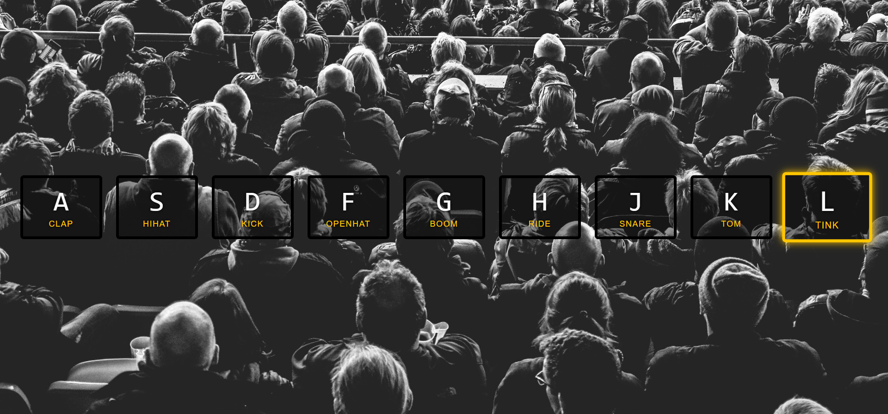

## Day 2: JavaScript Clock
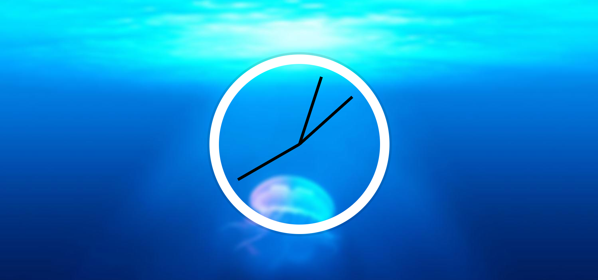

## Day 3: CSS Veriable

## Day 4: Array Cardio Practive-1
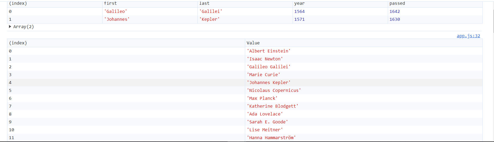
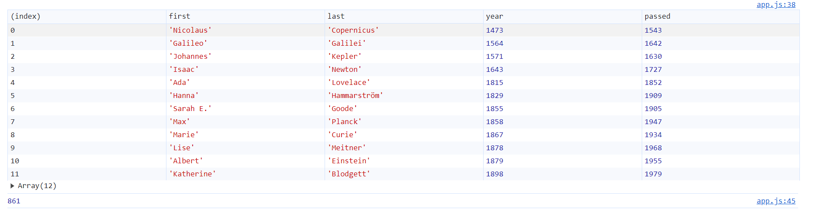
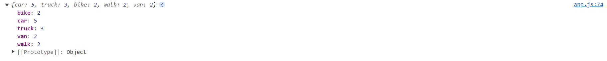

## Day 5: Flexbox 
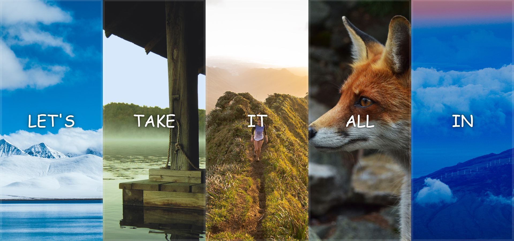
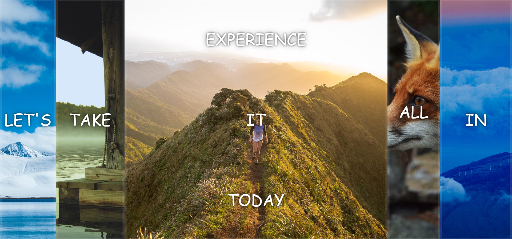
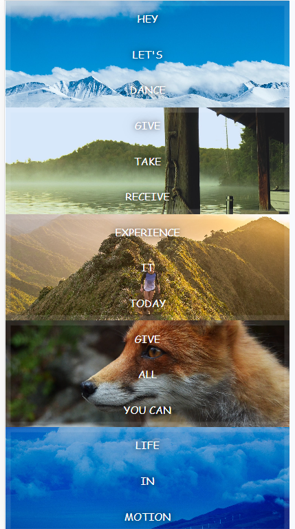

## Day 6: Ajax-Type-Ahead
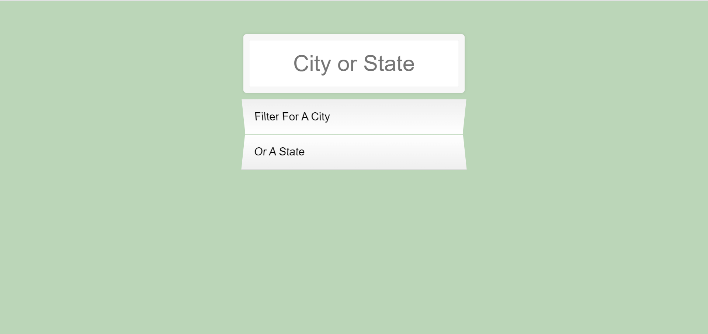
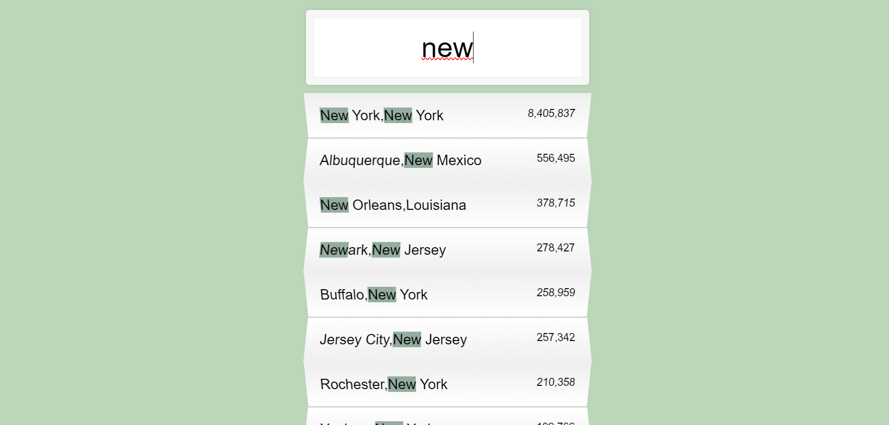

## Day 7: Array Cardio Practive-2
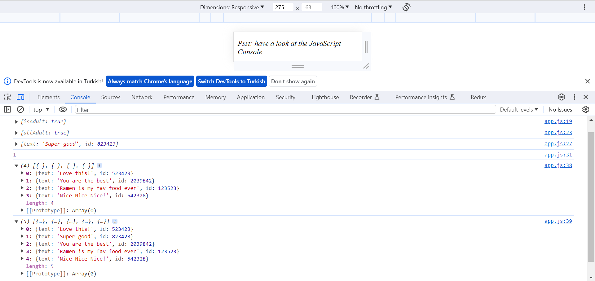

## Day 8: Fun With HTML Canvas
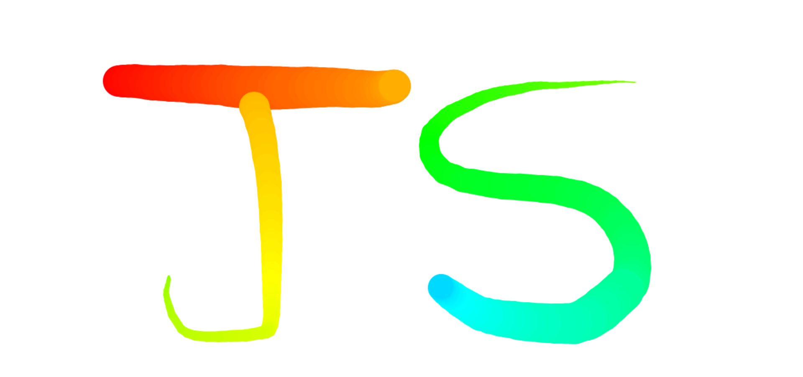

## Day 9: Dev Tool Tricks
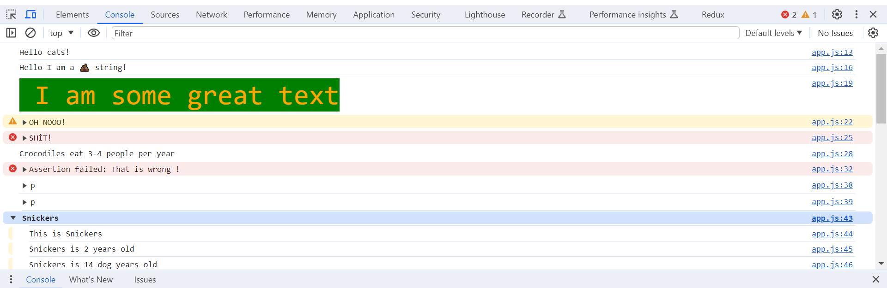
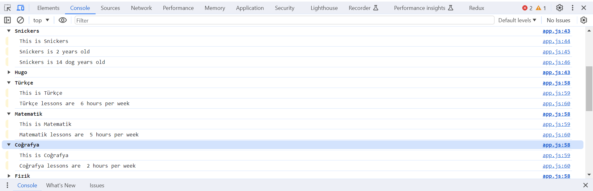
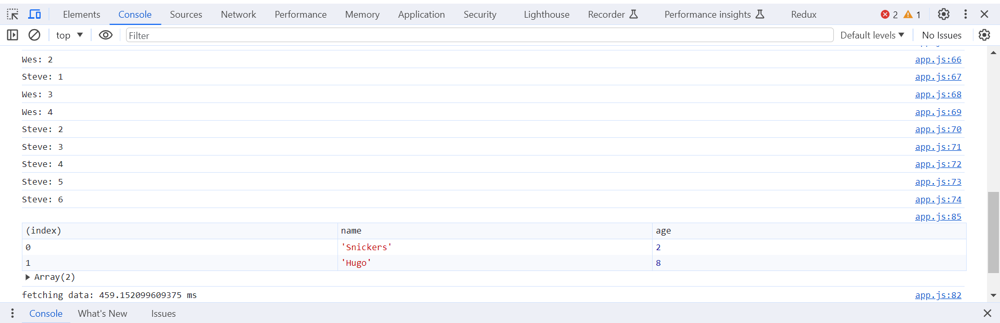

## Day 10: JS Checkbox Challenge
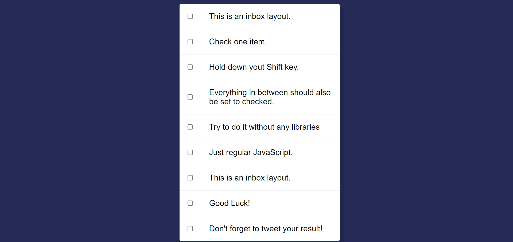
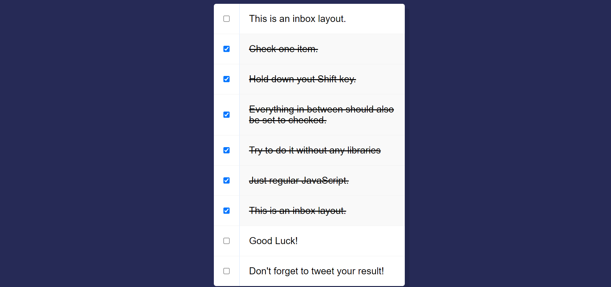

## Day 11: HTML Video Player 

## Day 12: Key Detection
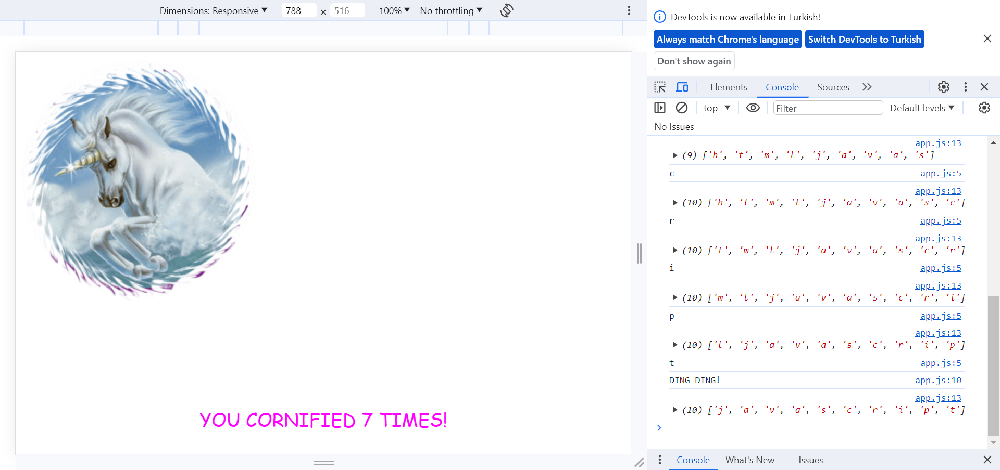

## Day 13: Slide In on Scroll 
### Scroll ilerledikçe fotoğrafların boyutuna göre fotoğraflar açılır.
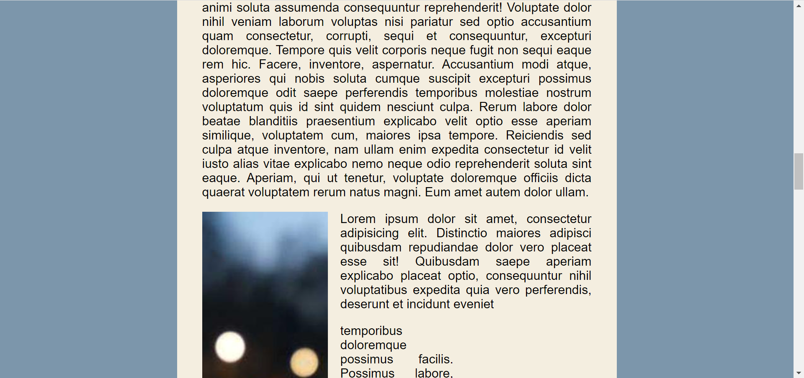
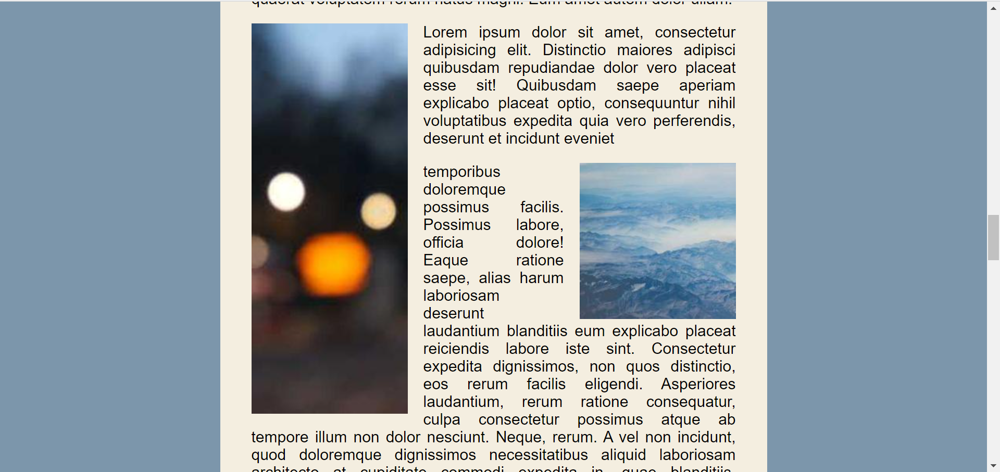

## Day 14: Object and Arrays - Reference VS Copy
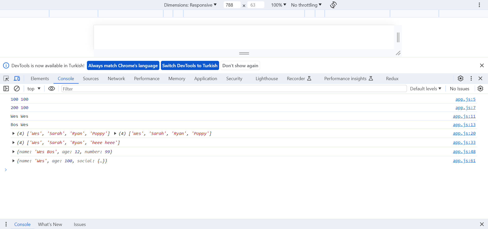

## Day 15: LocalStorage and Event Delegation

## Day 16: CSS Text Shadow on Mouse Move Effect
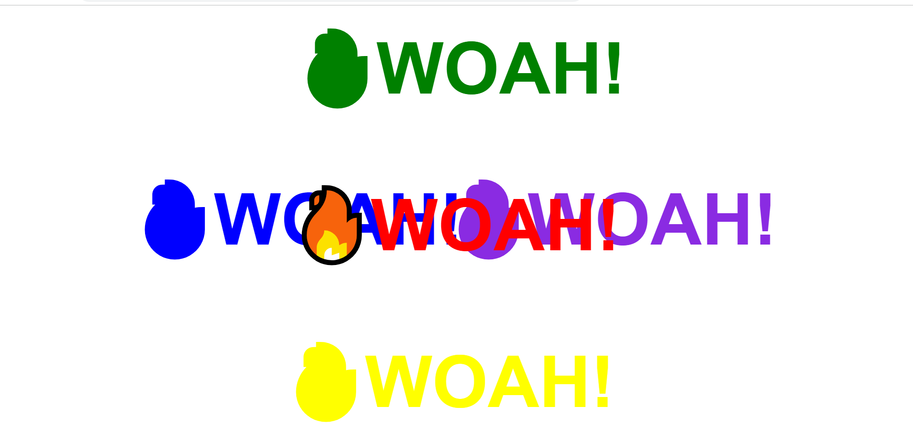

## Day 17: Sorting Band Names without Articles
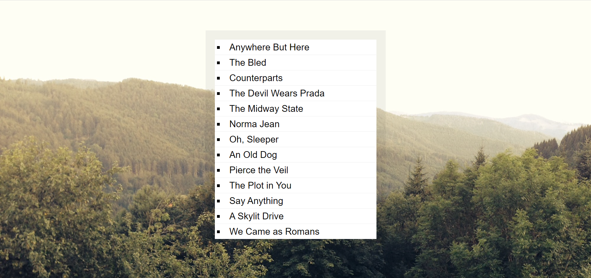